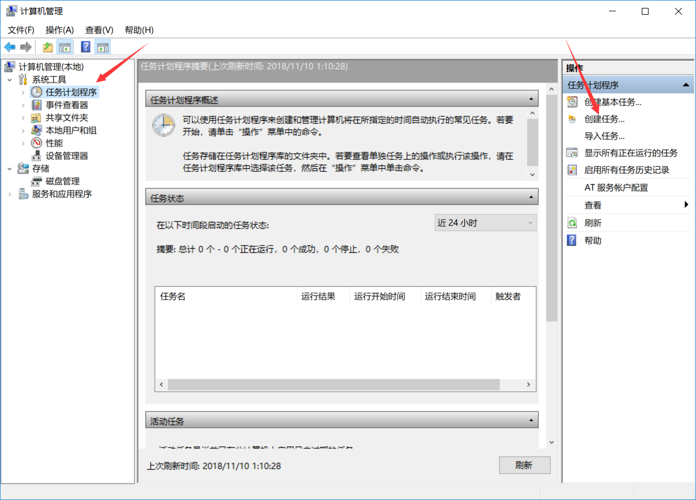
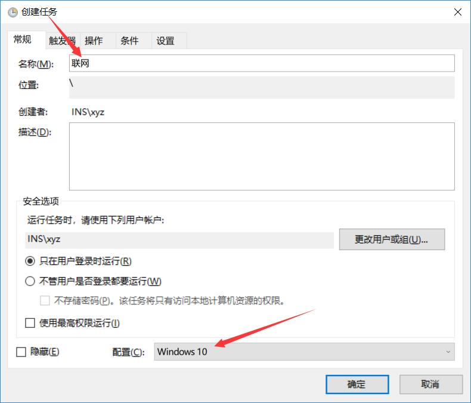
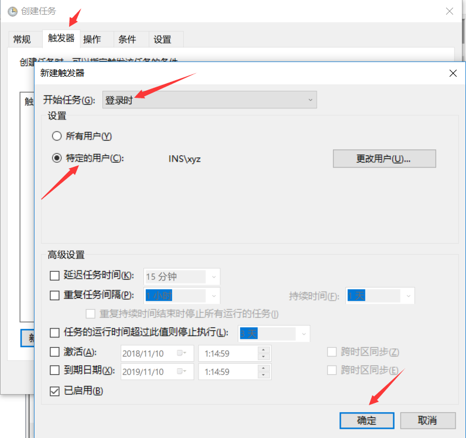
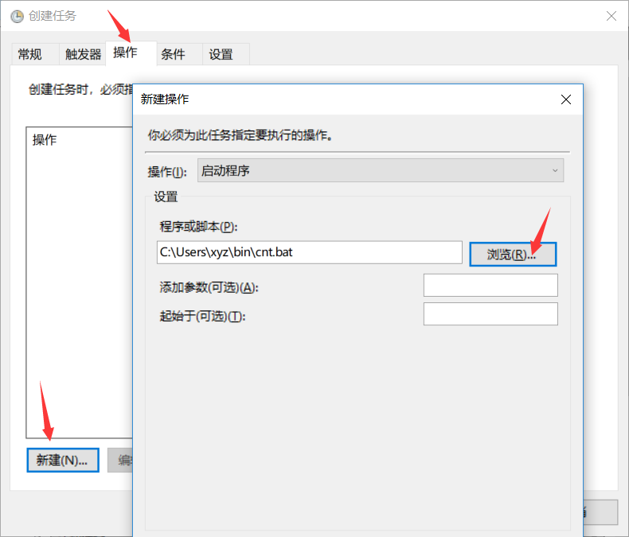

# Windows开机自动连接PPPoE解决方案

使用命令行命令`rasdial`实现PPPoE拨号，并通过Windows计划任务实现开机后自动连接网络的目的。

## 1、自动连接脚本的实现

在Windows中，使用`rasdial`命令连接PPPoE。
使用方法:

```shell
rasdial [连接名称] [用户名] [密码]
```

使用该命令之前，需要在设置中先创建一个宽带连接。如图所示:


创建好连接之后，就可以使用命令连接了。

```shell
rasdial 宽带连接 2016301777 mypassword
```

其中，连接名为`宽带连接`，用户名是`2016301777`，密码是`mypassword`
断开连接的命令是:

```shell
rasdial [连接名] /disconnect
```

我已经将连接和断开连接的命令写为`cnt.bat`和`dcnt.bat`脚本，双击即可运行。
将此脚本保存备用。

## 2、创建Windows计划任务

按下`Win + S`，输入`计算机管理`并打开它。
依次点击`任务计划程序`，`创建任务`。



输入任务名称。



然后点击上面的`触发器`，`新建`。按照图中箭头所示进行设置。



然后点击`操作`，`新建`。脚本位置选择上一步创建好的脚本。



保存即可。下次重启后会自动连接。

Enjoy yourself.